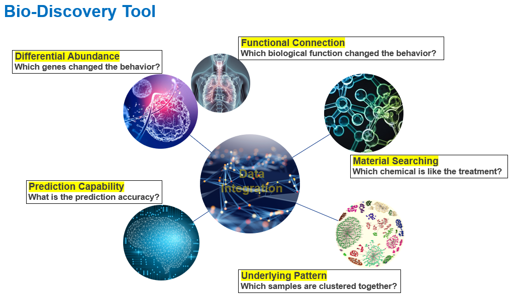

# Biodiscovery Shiny app

The Shiny app is deployed at an internal server and the core code is kept in this repository.

We developed this multi-omics based analysis dashboard enabling the following analyses: 
(1) differential abundance analysis; 
(2) functional connection; 
(3) material connection; 
(4) exploration of data pattern; 
(5) phenotypic outcome prediction with a machine learning model.  

